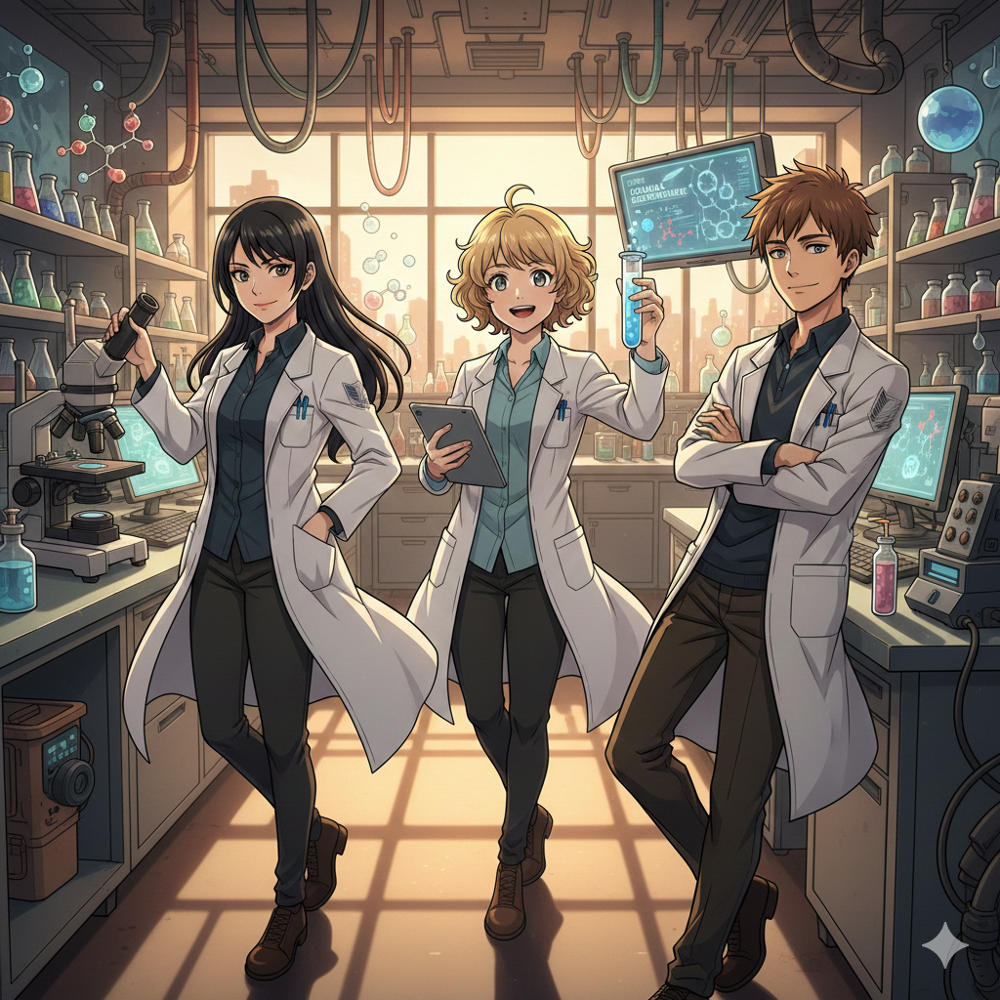

# Medical_Camp_
This website was created to provide an interactive and engaging experience for our university’s medical camp. It introduces the doctors, their specialties, and services in a fun, animated way while giving participants all the information they need. The goal is to make the medical camp accessible, informative, and easy to register.

<!DOCTYPE html>
<html lang="en">
<head>
    <meta charset="UTF-8">
    <meta name="viewport" content="width=device-width, initial-scale=1.0">
    <title>University Medical Camp | Animated Intro</title>
    
    <link href="https://cdnjs.cloudflare.com/ajax/libs/animate.css/4.1.1/animate.min.css" rel="stylesheet">
    
</head>
<body>

    <!-- Intro: Matrix Rain -->
    <canvas id="matrix-canvas"></canvas>

    <!-- Page 1: The Boom & Banner -->
    <section id="page1" class="page bg-white relative overflow-hidden">
        

            <h1 class="text-7xl font-black text-blue-600 animate__animated animate__zoomIn">BOOM!</h1>
        

        
        

            
WELCOME TO OUR MEDICAL CAMP

            
        

        <button onclick="nextPage(2)" class="mt-12 px-10 py-4 bg-blue-600 text-white rounded-full font-bold shadow-xl active:scale-95 transition-all">Meet Our Team →</button>
    </section>

    <!-- Page 2: Doctor Introductions -->
    <section id="page2" class="page bg-blue-50">
        <h2 class="text-2xl font-bold text-blue-900 mb-8">Meet Your Specialists</h2>
        
        

            <!-- Doctor: Physiotherapist -->
            

                

                    

                        "Hi, I am a Physiotherapist. I specialize in restoring movement!"
                    

                    
                

            

            <!-- Doctor: Sonologist -->
            

                

                    

                        "Hello! I am your Sonologist. I use sound waves to see inside!"
                    

                    
                

            

            <!-- Doctor: Gynecologist -->
            

                

                    

                        "I am a Gynecologist, providing expert care for women's health."
                    

                    
                

            

            <!-- Doctor: Lab Technician -->
            

                

                    

                        "I am the Lab Technician. Ensuring accurate diagnostic results!"
                    

                    
                

            

        

        

            <button onclick="cycleDoctor()" id="next-doc-btn" class="px-8 py-3 bg-blue-600 text-white rounded-xl font-bold shadow-lg">Next Specialist</button>
            <button onclick="nextPage(3)" id="group-btn" class="hidden px-8 py-3 bg-green-600 text-white rounded-xl font-bold shadow-lg">Final Message →</button>
        

    </section>

    <!-- Page 3: Group Welcome -->
    <section id="page3" class="page bg-white">
        

            <h2 class="text-3xl font-black text-blue-600 mb-6 animate__animated animate__pulse animate__infinite">WE ARE HERE FOR YOU</h2>
            

                

                    "Join us for consultations, check-ups, and professional guidance. We welcome you all!"
                

                
            

            <button onclick="nextPage(4)" class="mt-10 px-12 py-5 bg-blue-600 text-white rounded-full font-black text-xl shadow-2xl transform transition hover:scale-105">REGISTER NOW</button>
        

    </section>

    <!-- Page 4: Registration -->
    <section id="page4" class="page bg-gray-50">
        

            <h2 class="text-3xl font-black text-gray-800 mb-2">Registration</h2>
            
Please enter your details below.

            
            <form id="regForm" onsubmit="handleRegistration(event)">
                <input type="text" placeholder="Full Name" required class="form-input">
                <input type="email" placeholder="Email Address" required class="form-input">
                <input type="tel" placeholder="Contact Number" required class="form-input">
                
                

                    <input type="number" placeholder="Age" required class="form-input w-1/3">
                    <select class="form-input w-2/3">
                        <option>Male</option>
                        <option>Female</option>
                        <option>Other</option>
                    </select>
                

                <textarea placeholder="Medical Concern / History" rows="3" class="form-input"></textarea>
                
                <label class="flex items-center mt-4 text-sm font-semibold text-gray-700">
                    <input type="checkbox" required class="mr-3 h-6 w-6 rounded border-2 border-blue-500">
                    I agree to the camp terms.
                </label>

                <button type="submit" class="w-full mt-8 py-5 bg-green-600 text-white font-black text-xl rounded-2xl shadow-lg active:scale-95 transition-all">
                    SUBMIT DATA
                </button>
            </form>
            

                REGISTRATION COMPLETE!
            

        

    </section>

    <!-- Audio Effects -->
    <audio id="sound-rain" loop src="https://assets.mixkit.co/active_storage/sfx/2557/2557-preview.mp3"></audio>
    <audio id="sound-pop" src="https://assets.mixkit.co/active_storage/sfx/2014/2014-preview.mp3"></audio>

    
</body>
</html>

